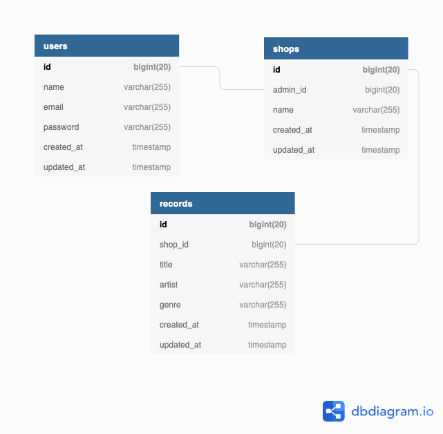

# Records Shop Api

#### Installation
##### Pre-requisite:
- Docker
##### Steps:
- ``git clone`` or download this repository:
- From project root run ``./bin/install.sh`` (Be Patient :))
- Visit ``http://localhost:9090`` it will redirect you to swagger documentation


##### DB (GUI):

``` 
hostname: 127.0.0.1
user: homstead
password: secret
port: 3308
database: bee
   ```
#### Environment

- Docker based environment 3 containers ``nginx``, ``php``, ``mysql``

#### Tech Stack / Libraries

- Nginx
- Laravel Php Framework
- Docker
- Mysql

#### ER Diagram


###### Note:
``users`` and ``shops`` tables are just for completeness and demo purposes, these tables has nothing to do with the main functionality of this project.

##### APP:
- There are 3 records seeded at the time of installation in the **records** table.
- you can create more by following the documentation and start play around with them.

##### SEARCH:
- Search functionality is not specific to fields I created it as generic by using ``FULL_TEXT`` search index of MySQL,
- When you provide a keyword it checks in ``title`` and ``artist`` fields and whatever matches it will fetch those records.

#### Test
- By default, when you install, tests runs all the tests automatically.
- But if, you want to run it manually below is the command.
- ``docker-compose exec php ./vendor/bin/phpunit ./tests/``